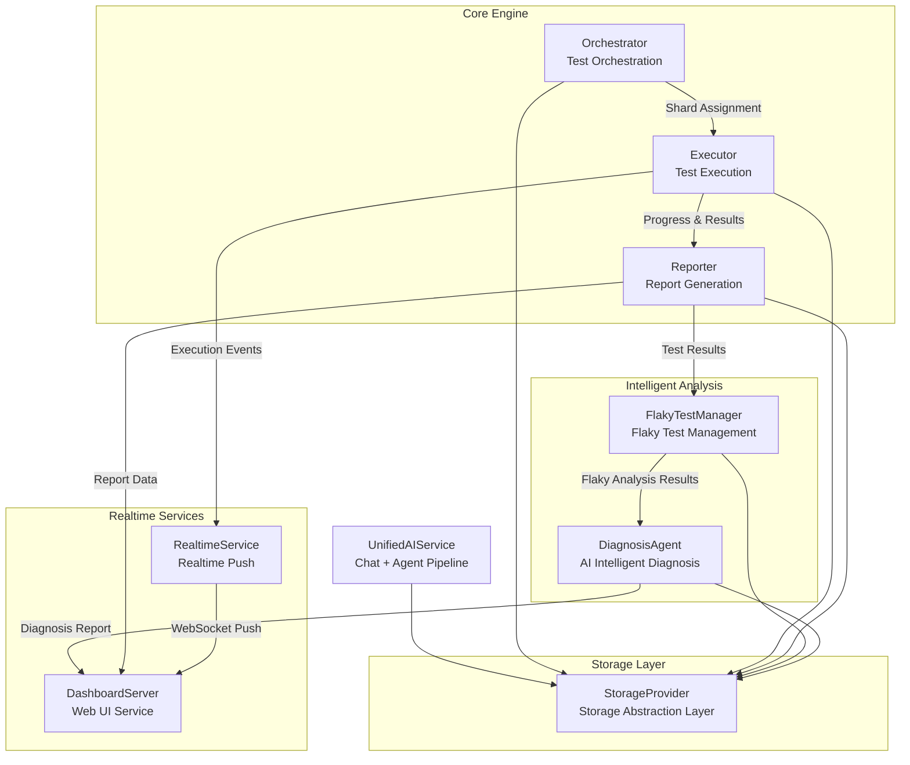
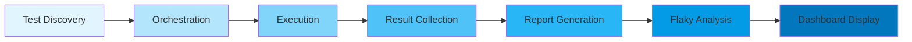
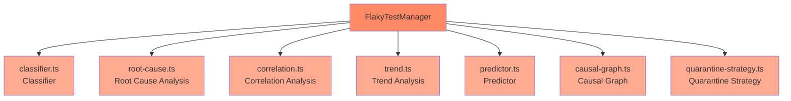
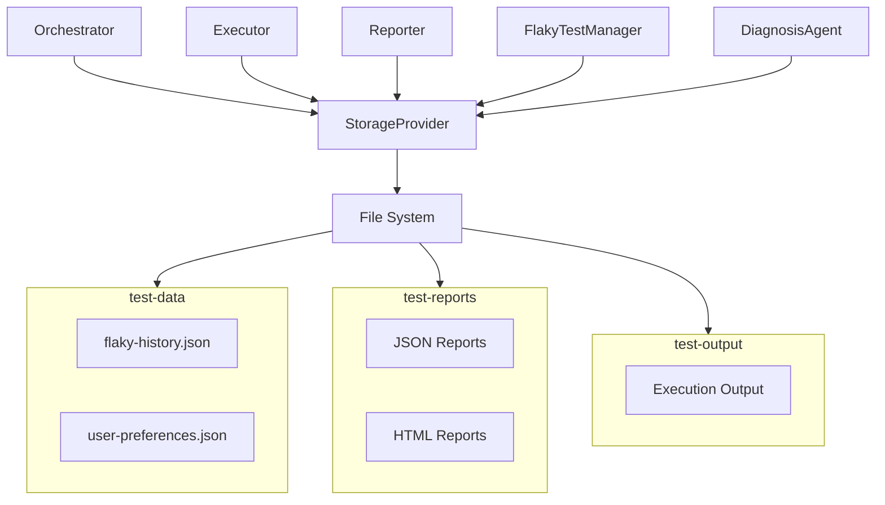

# YuanTest Playwright System Architecture Overview

## 1. System Architecture Overview

YuanTest Playwright is an intelligent end-to-end test orchestration and execution platform that provides a complete closed-loop capability around the test lifecycle, from discovery, orchestration, execution to analysis, diagnosis, and visualization.

### 1.1 Core Architecture Diagram



## 2. Data Flow Description

The system follows the data flow pipeline below, forming a complete closed loop from test discovery to final visualization:



| Phase | Description | Involved Modules |
|-------|-------------|------------------|
| Test Discovery | Scan test files in the project and identify executable test cases | Orchestrator |
| Orchestration | Perform shard assignment based on distributed/weighted/intelligent strategies | Orchestrator |
| Execution | Call Playwright CLI to run tests, supporting multi-browser and shard parallelism | Executor |
| Result Collection | Collect test progress, pass/fail status, error information, etc. | Executor → Reporter |
| Report Generation | Generate HTML reports, perform 6-category classification analysis for failed cases | Reporter |
| Flaky Analysis | Classify flaky tests, perform root cause analysis, trend prediction, and isolation | FlakyTestManager |
| Dashboard Display | Display reports and diagnosis results through Web UI, push execution status in real-time | DashboardServer + RealtimeService |

## 3. Module Responsibilities

### 3.1 Orchestrator — Test Orchestration

- **Source Location**: [src/orchestrator/index.ts](file:///d:/Coding/yuantest-playwright/src/orchestrator/index.ts)
- **Core Responsibility**: Responsible for test task orchestration and scheduling, determining how tests are assigned to different shards for execution
- **Key Capabilities**:
  - **distributed strategy**: Evenly distribute test cases to each shard
  - **weighted strategy**: Weighted distribution based on historical execution duration to balance shard load
  - **intelligent strategy**: Intelligent orchestration combining historical data and Flaky information, prioritizing high-value tests
  - **Shard Assignment**: Support multi-shard parallel execution to improve overall throughput

### 3.2 Executor — Test Execution

- **Source Location**: [src/executor/index.ts](file:///d:/Coding/yuantest-playwright/src/executor/index.ts)
- **Core Responsibility**: Call Playwright CLI to execute tests, collect execution progress and results
- **Key Capabilities**:
  - Call Playwright CLI to run test cases
  - Support multi-browser parallel execution (Chromium, Firefox, WebKit)
  - Support shard mode execution
  - Real-time collection of execution progress and test results
  - Push execution events to RealtimeService

### 3.3 Reporter — Report Generation

- **Source Location**: [src/reporter/index.ts](file:///d:/Coding/yuantest-playwright/src/reporter/index.ts)
- **Core Responsibility**: Generate test reports, perform classification analysis for failed cases
- **Key Capabilities**:
  - Generate HTML format visualized test reports
  - Failed case 6-category classification analysis:
    | Category | Description |
    |----------|-------------|
    | assertion | Assertion failure, expected value does not match actual value |
    | timeout | Execution timeout, not completed within specified time |
    | network | Network issue, request failed or abnormal response |
    | selector | Selector failure, element location failed |
    | frame | Page frame issue, iframe or navigation abnormality |
    | auth | Authentication/authorization issue, login state expired |

### 3.4 FlakyTestManager — Flaky Test Management

- **Source Location**: [src/flaky/index.ts](file:///d:/Coding/yuantest-playwright/src/flaky/index.ts)
- **Core Responsibility**: Identify, analyze, and manage flaky tests
- **Submodule Description**:



| Submodule | Responsibility |
|-----------|----------------|
| classifier.ts | Classify flaky tests and identify Flaky patterns |
| root-cause.ts | Deep analysis of root causes for flaky tests |
| correlation.ts | Analyze correlations between tests, identify cascade failures |
| trend.ts | Track historical trend changes of flaky tests |
| predictor.ts | Predict test stability probability based on historical data |
| causal-graph.ts | Build causal relationship graphs, reveal failure propagation paths |
| quarantine-strategy.ts | Develop quarantine strategies, isolate high Flaky tests for execution |

### 3.5 DiagnosisAgent — AI Intelligent Diagnosis

- **Source Location**: [src/ai/agents/diagnosis.ts](file:///d:/Coding/yuantest-playwright/src/ai/agents/diagnosis.ts)
- **Core Responsibility**: Use AI to diagnose test failures and generate structured diagnosis results (root cause analysis, fix suggestions, confidence scoring)
- **Key Technical Modules**:
  - **context-enricher.ts**: Context enrichment, automatically collecting source code, screenshots, console logs, stack traces, environment info, and history data
  - **knowledge-base.ts**: Knowledge base with 7 categories, 30+ error patterns, supporting auto-matching and custom pattern registration
  - **patterns/**: Category-split error pattern definition files (timeout, selector, assertion, network, frame, auth, other)
  - **categorizer.ts**: Error classifier that categorizes error messages into 7 predefined categories via regex matching
  - **response-parser.ts**: LLM response parser that converts JSON replies into structured `AIDiagnosis` objects with JSON extraction and fallback logic
  - **diagnosis-cache.ts**: In-memory cache, max 100 entries, TTL 30 minutes, LRU eviction
  - **diagnosis-persister.ts**: Disk persistence, stores diagnosis results by `runId` into `{dataDir}/diagnosis/` directory
  - **cluster.ts**: Failure cluster analysis using Jaccard similarity + Union-Find algorithm to group similar failures
- **Diagnosis Flow**: `prepareDiagnosis` (enrich context + match patterns + build prompt) → `callLLM`/`chatStream` (single LLM call, JSON response) → `finalizeDiagnosis` (parse response + calibrate confidence)
- **Streaming Diagnosis**: SSE-based real-time push of LLM-generated content, supporting `start`/`chunk`/`complete`/`error` event types

### 3.6 DashboardServer — Web UI Service

- **Source Location**: [src/ui/server.ts](file:///d:/Coding/yuantest-playwright/src/ui/server.ts)
- **Core Responsibility**: Provide Web interface to display test reports, diagnosis results, and real-time status
- **Key Capabilities**:
  - REST API (`/api/v1/`) provides data query interfaces
  - WebSocket real-time push of test execution status
  - Visualized display of reports, Flaky analysis, and diagnosis results

### 3.7 RealtimeService — Realtime Push Service

- **Source Location**: [src/realtime/index.ts](file:///d:/Coding/yuantest-playwright/src/realtime/index.ts)
- **Core Responsibility**: Push test execution events to clients in real-time via WebSocket
- **Key Capabilities**:
  - WebSocket event-driven architecture
  - Test start, progress update, test completion event push
  - Collaborate with DashboardServer

### 3.8 StorageProvider — Storage Abstraction Layer

- **Source Location**: [src/storage/index.ts](file:///d:/Coding/yuantest-playwright/src/storage/index.ts)
- **Core Responsibility**: Provide unified storage abstraction interface, shielding underlying storage implementation details
- **Key Capabilities**:
  - File storage implementation
  - Unified read/write interface, all modules access data through StorageProvider
  - Support future extension to databases and other storage backends

### 3.9 UnifiedAIService — Unified AI Service (Chat + Agent)

Previously split into `AgentService` and `ChatService + MCP`, these have been fully merged into a single `UnifiedAIService` class that directly owns all sub-modules with zero delegation.

- **Source Location**: [src/ai/ai-service.ts](file:///d:/Coding/yuantest-playwright/src/ai/ai-service.ts)
- **Core Responsibility**: Unified AI service combining conversational AI (chat + MCP) and AI-powered test creation/healing (agent pipeline)
- **Key Capabilities**:
  - **Conversation Management**: Create, read, list, delete conversations with persistent storage
  - **MCP Integration**: Connect/disconnect MCP servers, list tools, call tools, manage MCP configurations
  - **Agent Pipeline**: Plan → Generate → Heal test creation workflow with full configuration support
  - **Unified Configuration**: Single `updateLLMConfig()` and `setProjectRoot()` that synchronize across all subsystems
  - **Chat + Agent Integration**: `executeTool()` uses `Map<string, AgentToolDef>` strategy to route agent tools — `agent_execute`, `agent_diagnose`, `agent_generate`, `agent_heal` are natively available in chat conversations
  - **Project Context**: Auto-load playwright.config and package.json for context-aware agent operations
  - **Code Extraction**: Agent-generated code blocks are automatically extracted and saved to `tests/` directory with smart naming
- **Sub-modules**: `ConversationStore`, `MCPClientManager`, `PlannerAgent`, `GeneratorAgent`, `HealerAgent`, `AgentConfigManager`, `AgentLifecycleManager`, `AgentPipelineOrchestrator`, `AgentFileOperations`
- **Module Layout**: AI-related modules live under `src/ai/` including agent modules at `src/ai/agents/` (base-agent, healer, planner, generator, diagnosis, etc.)

### 3.11 ServiceContainer (DI) — Dependency Injection Container

- **Core Responsibility**: Dependency injection container managing service lifecycle, factory registration, and token-based resolution
- **Key Capabilities**:
  - Service lifecycle management (singleton, transient)
  - Factory registration and token-based resolution
  - Dependency graph construction and validation

### 3.12 TestDiscovery — Automatic Test File Discovery

- **Core Responsibility**: Automatic test file discovery with structured parsing, pagination, and caching support
- **Key Capabilities**:
  - Scan and discover test files in the project
  - Structured parsing of test metadata
  - Pagination support for large test suites
  - Caching of discovery results

### 3.13 VisualTestingManager — Visual Regression Testing

- **Core Responsibility**: Visual regression testing with screenshot comparison, baseline management, and diff reporting
- **Key Capabilities**:
  - Screenshot comparison with pixel and perceptual diff algorithms
  - Baseline image management and versioning
  - Diff report generation with visual highlighting

### 3.14 TraceManager — Playwright Trace Management

- **Core Responsibility**: Playwright trace file management including discovery, viewing, merging, and cleanup
- **Key Capabilities**:
  - Trace file discovery and indexing
  - Trace viewing and replay
  - Trace merging across shards
  - Trace cleanup and retention policies

### 3.15 ArtifactManager — Test Artifact Management

- **Core Responsibility**: Test artifact management for screenshots, videos, downloads, and attachments
- **Key Capabilities**:
  - Screenshot capture and storage
  - Video recording management
  - Download tracking and organization
  - Attachment handling for test results

### 3.16 AnnotationManager — Test Annotation Management

- **Core Responsibility**: Test annotation scanning and management (@skip, @only, @fail, @slow, etc.)
- **Key Capabilities**:
  - Scan test files for custom annotations
  - Support for @skip, @only, @fail, @slow, and custom annotations
  - Annotation-based test filtering and selection

### 3.17 TagManager — Test Tag Management

- **Core Responsibility**: Test tag scanning, filtering, and grep pattern generation
- **Key Capabilities**:
  - Scan test files for tags
  - Tag-based test filtering
  - Grep pattern generation for tag selection

### 3.18 Logger — Structured Logging

- **Core Responsibility**: Structured logging system with child loggers, log levels, and file-based output
- **Key Capabilities**:
  - Structured log output with context
  - Child logger creation for module-specific logging
  - Configurable log levels (debug, info, warn, error)
  - File-based log output with rotation

### 3.19 Cache (LRU/TTL) — In-Memory Caching

- **Core Responsibility**: In-memory caching with LRU eviction and TTL expiration support
- **Key Capabilities**:
  - LRU (Least Recently Used) eviction policy
  - TTL (Time To Live) expiration support
  - Configurable cache size and TTL values

### 3.20 Validation (Zod) — Request Validation

- **Core Responsibility**: Request validation using Zod schemas for API endpoints
- **Key Capabilities**:
  - Zod schema-based request validation
  - Automatic error response generation for invalid requests
  - Type-safe validation with inferred types

### 3.21 Middleware — Express Middleware

- **Core Responsibility**: Express middleware for async error handling, request validation, and 404 handling
- **Key Capabilities**:
  - Async error handling middleware
  - Request validation middleware with Zod integration
  - 404 not-found handler

### 3.22 i18n — Internationalization

- **Core Responsibility**: Internationalization support with Chinese and English languages
- **Key Capabilities**:
  - Multi-language support (Chinese, English)
  - Translation key management
  - Language detection and switching

### 3.23 Constants — Centralized Constants

- **Core Responsibility**: Centralized constant definitions for defaults, cache config, flaky config, WebSocket config, etc.
- **Key Capabilities**:
  - Default values for system configuration
  - Cache configuration constants
  - Flaky test configuration constants
  - WebSocket configuration constants

## 4. Storage Architecture

### 4.1 Directory Layout

```
Project Root/
├── test-data/                  # Runtime Data
│   ├── flaky-history.json      # Flaky Test History Records
│   └── user-preferences.json   # User Preference Configuration
├── test-reports/               # Test Reports
│   ├── *.json                  # JSON Format Report Data
│   └── *.html                  # HTML Format Visualized Reports
└── test-output/                # Default Output Directory
```

### 4.2 Directory Responsibilities

| Directory | Purpose | Read/Write Modules |
|-----------|---------|-------------------|
| `./test-data/` | Store persistent data generated at runtime, including Flaky history records and user preferences | FlakyTestManager, Orchestrator |
| `./test-reports/` | Store test reports, including JSON structured data and HTML visualized reports | Reporter, DashboardServer |
| `./test-output/` | Default output directory, storing temporary output during execution | Executor |

### 4.3 Storage Access Pattern



All modules access the storage layer uniformly through StorageProvider, avoiding direct file system operations to ensure data consistency and extensibility. The current implementation is based on file storage, which can be replaced with databases or other storage backends in the future without modifying business module code.
