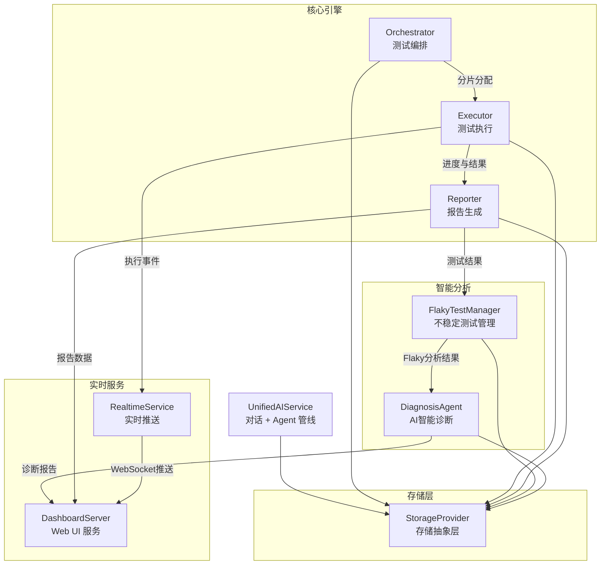
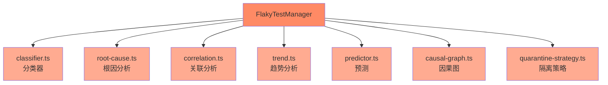
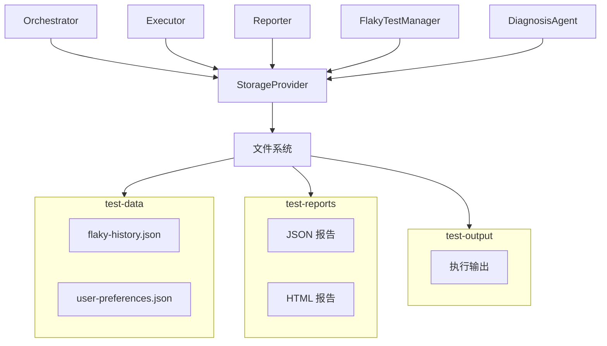

# YuanTest Playwright 系统架构概览

## 1. 系统架构总览

YuanTest Playwright 是一个智能化的端到端测试编排与执行平台，围绕测试生命周期提供从发现、编排、执行到分析、诊断、展示的完整闭环能力。

### 1.1 核心架构图



## 2. 数据流说明

系统遵循以下数据流管线，从测试发现到最终展示形成完整闭环：


| 阶段 | 说明 | 涉及模块 |
|------|------|----------|
| 测试发现 | 扫描项目中的测试文件，识别可执行测试用例 | Orchestrator |
| 编排 | 根据 distributed/weighted/intelligent 策略进行分片分配 | Orchestrator |
| 执行 | 调用 Playwright CLI 运行测试，支持多浏览器与分片并行 | Executor |
| 结果收集 | 收集测试进度、通过/失败状态、错误信息等 | Executor → Reporter |
| 报告生成 | 生成 HTML 报告，对失败用例进行 6 类分类分析 | Reporter |
| Flaky分析 | 对不稳定测试进行分类、根因分析、趋势预测与隔离 | FlakyTestManager |
| Dashboard展示 | 通过 Web UI 展示报告、诊断结果，实时推送执行状态 | DashboardServer + RealtimeService |

## 3. 各模块职责说明

### 3.1 Orchestrator — 测试编排

- **源码位置**：[packages/executor/src/orchestrator/index.ts](https://github.com/yuandiv/yuantest-playwright/blob/main/packages/executor/src/orchestrator/index.ts)
- **核心职责**：负责测试任务的编排与调度，决定测试如何分配到不同分片执行
- **关键能力**：
  - **distributed 策略**：均匀分配测试用例到各分片
  - **weighted 策略**：根据历史执行时长加权分配，平衡分片负载
  - **intelligent 策略**：结合历史数据与 Flaky 信息智能编排，优先执行高价值测试
  - **分片分配**：支持多分片并行执行，提升整体吞吐量

### 3.2 Executor — 测试执行

- **源码位置**：[packages/executor/src/executor/index.ts](https://github.com/yuandiv/yuantest-playwright/blob/main/packages/executor/src/executor/index.ts)
- **核心职责**：调用 Playwright CLI 执行测试，收集执行进度与结果
- **关键能力**：
  - 调用 Playwright CLI 运行测试用例
  - 支持多浏览器并行执行（Chromium、Firefox、WebKit）
  - 支持分片（shard）模式执行
  - 实时收集执行进度与测试结果
  - 将执行事件推送至 RealtimeService

### 3.3 Reporter — 报告生成

- **源码位置**：[packages/reporter/src/index.ts](https://github.com/yuandiv/yuantest-playwright/blob/main/packages/reporter/src/index.ts)
- **核心职责**：生成代码报告，对失败用例进行分类分析
- **关键能力**：
  - 生成 HTML 格式的可视化测试报告
  - 失败用例 6 类分类分析：
    | 分类 | 说明 |
    |------|------|
    | assertion | 断言失败，预期与实际不符 |
    | timeout | 执行超时，未在规定时间内完成 |
    | network | 网络问题，请求失败或响应异常 |
    | selector | 选择器失效，元素定位失败 |
    | frame | 页面框架问题，iframe 或导航异常 |
    | auth | 认证授权问题，登录态失效 |

### 3.4 FlakyTestManager — 不稳定测试管理

- **源码位置**：[packages/flaky/src/index.ts](https://github.com/yuandiv/yuantest-playwright/blob/main/packages/flaky/src/index.ts)
- **核心职责**：识别、分析和管理不稳定（Flaky）测试
- **子模块说明**：



| 子模块 | 职责 |
|--------|------|
| classifier.ts | 对不稳定测试进行分类，识别 Flaky 模式 |
| root-cause.ts | 深入分析不稳定测试的根本原因 |
| correlation.ts | 分析测试之间的关联性，识别级联失败 |
| trend.ts | 追踪不稳定测试的历史趋势变化 |
| predictor.ts | 基于历史数据预测测试的稳定性概率 |
| causal-graph.ts | 构建因果关系图，揭示失败传播路径 |
| quarantine-strategy.ts | 制定隔离策略，将高 Flaky 测试隔离执行 |

### 3.5 DiagnosisAgent — AI 智能诊断

- **源码位置**：[packages/ai/src/agents/diagnosis.ts](https://github.com/yuandiv/yuantest-playwright/blob/main/packages/ai/src/agents/diagnosis.ts)
- **核心职责**：利用 AI 对测试失败进行智能诊断，生成结构化诊断结果（根因分析、修复建议、置信度评分）
- **关键技术模块**：
  - **context-enricher.ts**：上下文富集，自动收集源代码、截图、控制台日志、堆栈跟踪、环境信息和历史数据
  - **knowledge-base.ts**：知识库，内置 7 大类 30+ 个错误模式，支持自动匹配与自定义模式注册
  - **patterns/**：按类别拆分的错误模式定义文件（timeout、selector、assertion、network、frame、auth、other）
  - **categorizer.ts**：错误分类器，基于正则匹配将错误消息归类为 7 种预定义类别
  - **response-parser.ts**：LLM 响应解析器，将 JSON 回复解析为结构化 `AIDiagnosis` 对象，含 JSON 提取与兜底降级逻辑
  - **diagnosis-cache.ts**：内存缓存，最大 100 条，TTL 30 分钟，LRU 淘汰策略
  - **diagnosis-persister.ts**：磁盘持久化，按 `runId` 存储诊断结果到 `{dataDir}/diagnosis/` 目录
  - **cluster.ts**：失败聚类分析，基于 Jaccard 相似度 + 并查集算法将相似失败归为同一组
- **诊断流程**：`prepareDiagnosis`（富集上下文 + 匹配模式 + 构建 Prompt）→ `callLLM`/`chatStream`（单次 LLM 调用，JSON 格式返回）→ `finalizeDiagnosis`（解析响应 + 校准置信度）
- **流式诊断**：基于 SSE 协议实时推送 LLM 生成内容，支持 `start`/`chunk`/`complete`/`error` 事件类型

### 3.6 DashboardServer — Web UI 服务

- **源码位置**：[apps/cli/src/ui/server.ts](https://github.com/yuandiv/yuantest-playwright/blob/main/apps/cli/apps/cli/src/ui/server.ts)
- **核心职责**：提供 Web 界面，展示测试报告、诊断结果与实时状态
- **关键能力**：
  - REST API（`/api/v1/`）提供数据查询接口
  - WebSocket 实时推送测试执行状态
  - 可视化展示报告、Flaky 分析、诊断结果

### 3.7 RealtimeService — 实时推送服务

- **源码位置**：[packages/reporter/src/realtime/index.ts](https://github.com/yuandiv/yuantest-playwright/blob/main/packages/reporter/src/realtime/index.ts)
- **核心职责**：通过 WebSocket 将测试执行事件实时推送给客户端
- **关键能力**：
  - WebSocket 事件驱动架构
  - 测试开始、进度更新、测试完成等事件推送
  - 与 DashboardServer 协同工作

### 3.8 StorageProvider — 存储抽象层

- **源码位置**：[packages/core/src/storage/index.ts](https://github.com/yuandiv/yuantest-playwright/blob/main/packages/core/src/storage/index.ts)
- **核心职责**：提供统一的存储抽象接口，屏蔽底层存储实现细节
- **关键能力**：
  - 文件存储实现
  - 统一的读写接口，各模块通过 StorageProvider 访问数据
  - 支持未来扩展至数据库等其他存储后端

### 3.9 UnifiedAIService — 统一 AI 服务（对话 + 代理）

原先分为 `AgentService` 和 `ChatService + MCP`，现已完全合并为单个 `UnifiedAIService` 类，直接持有所有子模块，零委托。

- **源码位置**：[packages/ai/src/ai-service.ts](https://github.com/yuandiv/yuantest-playwright/blob/main/packages/ai/src/ai-service.ts)
- **核心职责**：统一的 AI 服务，合并对话式 AI（对话 + MCP）和 AI 驱动的测试创建/修复（Agent 管线）
- **关键能力**：
  - **对话管理**：创建、读取、列出、删除对话，支持持久化存储
  - **MCP 集成**：连接/断开 MCP 服务器、列出工具、调用工具、管理 MCP 配置
  - **Agent 管线**：Plan → Generate → Heal 测试创建工作流，完整配置支持
  - **统一配置**：单一 `updateLLMConfig()` 和 `setProjectRoot()` 同步所有子系统
  - **对话 + Agent 集成**：`executeTool()` 使用 `Map<string, AgentToolDef>` 策略路由 Agent 工具 — `agent_execute`、`agent_diagnose`、`agent_generate`、`agent_heal` 在聊天中原生可用
  - **项目上下文**：自动加载 playwright.config 和 package.json，支持上下文感知的 Agent 操作
  - **代码提取**：Agent 生成的代码块自动提取并保存到 `tests/` 目录，支持智能命名
- **子模块**：`ConversationStore`、`MCPClientManager`、`PlannerAgent`、`GeneratorAgent`、`HealerAgent`、`AgentConfigManager`、`AgentLifecycleManager`、`AgentPipelineOrchestrator`、`AgentFileOperations`
- **模块布局**：AI 相关模块位于 `packages/ai/src/` 下，包括 `packages/ai/src/agents/` 中的 Agent 模块（base-agent、healer、planner、generator、diagnosis 等）

### 3.11 ServiceContainer (DI) — 依赖注入容器

- **核心职责**：依赖注入容器，管理服务生命周期、工厂注册和基于令牌的解析
- **关键能力**：
  - 服务生命周期管理（单例、瞬态）
  - 工厂注册和基于令牌的解析
  - 依赖图构建和验证

### 3.12 TestDiscovery — 自动测试文件发现

- **核心职责**：自动测试文件发现，支持结构化解析、分页和缓存
- **关键能力**：
  - 扫描和发现项目中的测试文件
  - 测试元数据的结构化解析
  - 大型测试套件的分页支持
  - 发现结果的缓存

### 3.13 VisualTestingManager — 视觉回归测试

- **核心职责**：视觉回归测试，支持截图对比、基线管理和差异报告
- **关键能力**：
  - 截图对比，支持像素和感知差异算法
  - 基线图像管理和版本控制
  - 差异报告生成，含视觉高亮

### 3.14 TraceManager — Playwright Trace 管理

- **核心职责**：Playwright Trace 文件管理，包括发现、查看、合并和清理
- **关键能力**：
  - Trace 文件发现和索引
  - Trace 查看和回放
  - 跨分片 Trace 合并
  - Trace 清理和保留策略

### 3.15 ArtifactManager — 测试产物管理

- **核心职责**：测试产物管理，包括截图、视频、下载和附件
- **关键能力**：
  - 截图捕获和存储
  - 视频录制管理
  - 下载跟踪和组织
  - 测试结果的附件处理

### 3.16 AnnotationManager — 测试注解管理

- **核心职责**：测试注解扫描和管理（@skip、@only、@fail、@slow 等）
- **关键能力**：
  - 扫描测试文件中的自定义注解
  - 支持 @skip、@only、@fail、@slow 及自定义注解
  - 基于注解的测试过滤和选择

### 3.17 TagManager — 测试标签管理

- **核心职责**：测试标签扫描、过滤和 grep 模式生成
- **关键能力**：
  - 扫描测试文件中的标签
  - 基于标签的测试过滤
  - 标签选择的 grep 模式生成

### 3.18 Logger — 结构化日志

- **核心职责**：结构化日志系统，支持子日志器、日志级别和文件输出
- **关键能力**：
  - 带上下文的结构化日志输出
  - 子日志器创建用于模块特定日志
  - 可配置日志级别（debug、info、warn、error）
  - 带轮转的文件日志输出

### 3.19 Cache (LRU/TTL) — 内存缓存

- **核心职责**：内存缓存，支持 LRU 驱逐和 TTL 过期
- **关键能力**：
  - LRU（最近最少使用）驱逐策略
  - TTL（生存时间）过期支持
  - 可配置的缓存大小和 TTL 值

### 3.20 Validation (Zod) — 请求验证

- **核心职责**：使用 Zod Schema 进行 API 端点请求验证
- **关键能力**：
  - 基于 Zod Schema 的请求验证
  - 无效请求的自动错误响应生成
  - 带推断类型的类型安全验证

### 3.21 Middleware — Express 中间件

- **核心职责**：Express 中间件，用于异步错误处理、请求验证和 404 处理
- **关键能力**：
  - 异步错误处理中间件
  - 集成 Zod 的请求验证中间件
  - 404 未找到处理器

### 3.22 i18n — 国际化

- **核心职责**：国际化支持，支持中文和英文
- **关键能力**：
  - 多语言支持（中文、英文）
  - 翻译键管理
  - 语言检测和切换

### 3.23 Constants — 集中常量

- **核心职责**：集中常量定义，包括默认值、缓存配置、Flaky 配置、WebSocket 配置等
- **关键能力**：
  - 系统配置的默认值
  - 缓存配置常量
  - Flaky 测试配置常量
  - WebSocket 配置常量

## 4. 存储架构说明

### 4.1 目录布局

```
项目根目录/
├── test-data/                  # 运行数据
│   ├── flaky-history.json      # 不稳定测试历史记录
│   └── user-preferences.json   # 用户偏好配置
├── test-reports/               # 测试报告
│   ├── *.json                  # JSON 格式报告数据
│   └── *.html                  # HTML 格式可视化报告
└── test-output/                # 默认输出目录
```

### 4.2 各目录职责

| 目录 | 用途 | 读写模块 |
|------|------|----------|
| `./test-data/` | 存储运行时产生的持久化数据，包括 Flaky 历史记录和用户偏好 | FlakyTestManager、Orchestrator |
| `./test-reports/` | 存储测试报告，包含 JSON 结构化数据和 HTML 可视化报告 | Reporter、DashboardServer |
| `./test-output/` | 默认输出目录，存放执行过程中的临时输出 | Executor |

### 4.3 存储访问模式



所有模块通过 StorageProvider 统一访问存储层，避免直接操作文件系统，确保数据一致性与可扩展性。当前实现基于文件存储，未来可替换为数据库或其他存储后端，无需修改业务模块代码。
