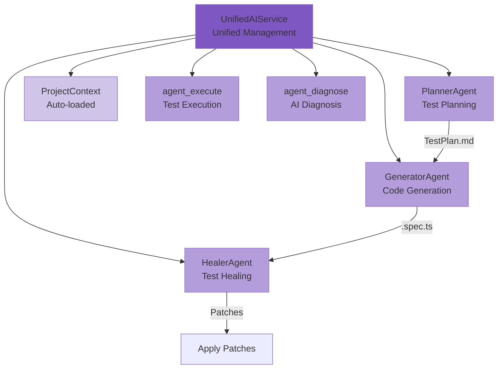
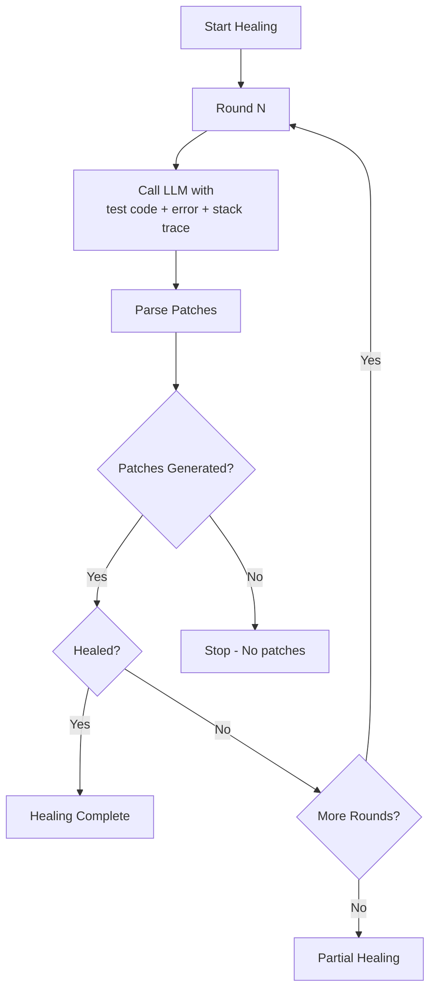

# AI Agent System Deep Guide

YuanTest Playwright's Agent System provides AI-powered test creation and healing capabilities through three specialized agents: Planner, Generator, and Healer.

## 1. System Architecture

The Agent system consists of the following core components:



| Component | Source File | Responsibility |
|-----------|-------------|----------------|
| UnifiedAIService | `packages/ai/src/ai-service.ts` | Unified facade combining ChatService + AgentService |
| AgentService (deprecated) | `packages/ai/src/agents/index.ts` | Backward compatible alias for UnifiedAIService |
| PlannerAgent | `packages/ai/src/agents/planner.ts` | Generate structured test plans from feature descriptions |
| GeneratorAgent | `packages/ai/src/agents/generator.ts` | Transform test plans into Playwright TypeScript code |
| HealerAgent | `packages/ai/src/agents/healer.ts` | Analyze failing tests and generate fix patches |

## 2. Project Context

The Agent system automatically loads project context to provide more precise results:

### 2.1 Context Sources

| Source | Information Extracted |
|--------|----------------------|
| `playwright.config.ts/js/mts` | baseURL, timeout, testDir, viewport |
| `package.json` | Project name, dependencies, tech stack detection |
| Test fixtures | Auto-discovered `tests/fixtures.ts` or `test/fixtures.ts` |

### 2.2 Tech Stack Detection

The system automatically detects the following technologies from `package.json` dependencies:

- **Frontend Frameworks**: React, Vue, Angular, Svelte
- **Meta-frameworks**: Next.js, Nuxt
- **Build Tools**: Vite, Webpack

### 2.3 Context Usage

Project context is injected into the Planner agent's prompt to generate precise test steps with concrete locators:

```
Application Information:
- URL: http://localhost:3000
- Tech Stack: React, Vite
- Viewport: 1280x720
- Default Timeout: 30000ms
- Test Directory: ./e2e
- Fixtures: tests/fixtures.ts
- Project Name: my-app
- Project Root: /path/to/project
```

## 3. Planner Agent

### 3.1 How It Works

1. Receives a feature description in natural language
2. Loads project context (baseURL, tech stack, viewport, etc.)
3. Optionally includes seed test code and PRD content
4. Calls LLM with structured system prompt requiring JSON output
5. Parses the response into a `TestPlan` object
6. Saves the plan as a Markdown file

### 3.2 System Prompt Design

The Planner agent uses a carefully designed system prompt that:
- Instructs the LLM to act as a professional test planning expert
- Requires the use of concrete page element locators (getByRole, getByText, getByLabel)
- Enforces JSON-only output format (no markdown, no code blocks)
- Defines the exact JSON schema: `title`, `description`, `scenarios[].name/steps/expectedResults`

### 3.3 Plan Output Format

The generated plan is saved as a Markdown file:

```markdown
# User Login Flow

Test the complete user login flow including form validation

**Seed:** `tests/example.spec.ts`

## Valid Login

**Steps:**
1. Navigate to login page on `login-page`
2. Enter username with "testuser"
3. Enter password with "password123"
4. Click submit button on `submit-btn`

**Expected Results:**
- User is redirected to dashboard
- Welcome message is displayed
```

### 3.4 Using Seed Tests

Seed tests provide the LLM with reference code style and patterns:

```typescript
const result = await agentService.plan('Shopping cart', {
  seedTest: 'tests/cart.spec.ts',  // Reference for code style
});
```

### 3.5 Using PRD Documents

PRD documents help align test plans with product requirements:

```typescript
const result = await agentService.plan('Payment feature', {
  prdPath: 'docs/payment-prd.md',  // PRD content (first 3000 chars used)
});
```

## 4. Generator Agent

### 4.1 How It Works

1. Reads the Markdown test plan file
2. Optionally includes seed test code for consistent style
3. Calls LLM with TypeScript code generation prompt
4. Extracts code blocks from the response
5. Saves each code block as a `.spec.ts` file

### 4.2 Code Generation Guidelines

The Generator agent follows these guidelines:
- Uses modern Playwright locators (`page.getByRole`, `page.getByText`, `page.getByLabel`)
- Includes appropriate assertions
- Follows testing best practices
- Each test scenario is independently runnable
- Code starts with import statements

### 4.3 Code Block Extraction

The agent extracts code blocks that contain Playwright test patterns:
- Blocks containing `test(` or `test.describe`
- Blocks containing `import` statements
- TypeScript/JavaScript code blocks from the LLM response

### 4.4 File Naming

Generated files are named based on the test description:
- `test.describe('Shopping Cart')` → `shopping-cart.spec.ts`
- `test('User can login')` → `user-can-login.spec.ts`
- Fallback: `generated-{timestamp}.spec.ts`

## 5. Healer Agent

### 5.1 How It Works



### 5.2 Multi-Round Healing

The Healer agent supports multi-round healing:
- Default: 3 rounds (configurable via `maxHealRounds`)
- Each round receives the previous round's summary as additional context
- Round N prompt includes: "This is round N of healing attempts, previous fixes may not have fully resolved the issue"
- Healing stops early if no patches are generated or if the test is marked as healed

### 5.3 Patch Format

Each patch contains:

| Field | Description |
|-------|-------------|
| `filePath` | Target file path for the patch |
| `originalCode` | Original code to be replaced |
| `patchedCode` | New code to replace with |
| `unifiedDiff` | Unified diff output |
| `confidence` | Confidence score (0-1) |
| `reason` | Explanation of the fix |

### 5.4 Security

- **Path validation**: Patches can only be applied to files within the project root
- **Content verification**: Before applying, the system checks that `originalCode` exists in the target file
- **Manual review**: By default (`autoHeal: false`), patches require manual approval

### 5.5 Auto-Heal Mode

When `autoHeal` is enabled:
```typescript
const agentService = new AgentService('./test-data', {
  autoHeal: true,
  maxHealRounds: 5,
}, llmConfig);
```

Patches are automatically applied after generation, with each patch marked as `appliedBy: 'auto'`.

## 6. LLM Configuration

The Agent system uses the same LLM configuration as the AI Diagnosis module:

```typescript
interface LLMConfig {
  enabled: boolean;
  baseUrl: string;      // Default: 'http://localhost:11434'
  model: string;        // e.g., 'qwen2.5-coder:7b'
  apiKey?: string;
  maxTokens?: number;   // Planner: 4096, Generator: 8192, Healer: 4096
  temperature?: number; // Planner: 0.3, Generator: 0.2, Healer: 0.2
}
```

### 6.1 Recommended Models

| Agent | Recommended Model | Reason |
|-------|-------------------|--------|
| Planner | qwen2.5-coder:7b+ | Good at structured JSON output |
| Generator | qwen2.5-coder:7b+ | Strong code generation capability |
| Healer | qwen2.5-coder:7b+ | Good at code analysis and patching |

### 6.2 Compatible LLM Services

- **Ollama** (recommended for local use): `baseUrl: 'http://localhost:11434'`
- **OpenAI**: `baseUrl: 'https://api.openai.com/v1'`
- **vLLM**: Any OpenAI-compatible endpoint
- **Azure OpenAI**: Azure OpenAI endpoint

## 7. Heal History

### 7.1 Storage

Heal history is persisted to `{dataDir}/agent-heal-history.json`:
- Maximum 100 entries (auto-cleanup)
- Each entry contains: testId, testTitle, patches, healed status, roundsUsed

### 7.2 Accessing History

```
GET /api/v1/agents/heal-history
```

> **Note**: The `getHealHistory()` API method has been removed in v1.2.0. Heal history is now only accessible via the REST API endpoint. The `listPlans()` method and `agents list` CLI command have also been removed.

## 8. CLI Usage

### 8.1 Initialize Agents

```bash
# For VSCode
yuantest agents init

# For Claude
yuantest agents init --loop claude

# For OpenCode
yuantest agents init --loop opencode
```

### 8.2 Generate Test Plan

```bash
# Basic usage
yuantest agents plan "User login flow"

# With seed test and PRD
yuantest agents plan "Shopping cart" --seed tests/cart.spec.ts --prd docs/prd.md
```

### 8.3 Generate Test Code

```bash
# From plan file
yuantest agents generate specs/user-login-flow.md

# With custom output
yuantest agents generate specs/user-login-flow.md --output tests/
```

### 8.4 Heal Failing Test

```bash
# Basic healing
yuantest agents heal tests/login.spec.ts

# With error context and auto-apply
yuantest agents heal tests/login.spec.ts --error "Timeout" --apply
```

### 8.5 List Plans (Removed)

> **Removed in v1.2.0**: The `agents list` subcommand and `agents-list` CLI command have been removed. Use the REST API `GET /api/v1/agents/plans` endpoint instead.

### 8.6 Chat with Agent Tools

In v1.2.0, the `UnifiedAIService` chat interface integrates Agent tools directly. During a conversation, the LLM can invoke the following built-in Agent tools:

| Tool | Description |
|------|-------------|
| `agent_execute` | Run Playwright tests and return pass/fail statistics |
| `agent_diagnose` | AI diagnosis of test failures with root cause and fix suggestions |
| `agent_generate` | Generate Playwright TypeScript test code from a test plan |
| `agent_heal` | Analyze a failing test and generate fix patches |

These tools are registered via a `Map<string, AgentToolDef>` strategy pattern — no longer hardcoded in `executeTool()` if-else chains. This means users can simply ask "run the tests" or "why did this test fail?" during a chat session, and the AI will automatically use the appropriate tool.

## 9. REST API

All Agent functionality is accessible via REST API:

| Method | Endpoint | Description |
|--------|----------|-------------|
| `GET` | `/api/v1/agents/config` | Get agent configuration |
| `PUT` | `/api/v1/agents/config` | Update agent configuration |
| `GET` | `/api/v1/agents/project-context` | Get project context |
| `POST` | `/api/v1/agents/init` | Initialize agent definitions |
| `POST` | `/api/v1/agents/plan` | Generate test plan |
| `POST` | `/api/v1/agents/generate` | Generate test code |
| `POST` | `/api/v1/agents/heal` | Heal failing test |
| `POST` | `/api/v1/agents/apply-patch` | Apply a specific patch |

> **Note**: `GET /api/v1/agents/plans` and `GET /api/v1/agents/heal-history` endpoints have been removed in v1.2.0 along with the corresponding API methods (`listPlans()`, `getHealHistory()`).

## 10. Best Practices

### 10.1 Writing Feature Descriptions

- Be specific about the feature and user interactions
- Include page names, element names, and expected behaviors
- Mention any special conditions or edge cases

**Good**: "User login flow with email and password, including form validation and error messages"

**Bad**: "Login test"

### 10.2 Using Seed Tests

- Provide a representative test file that demonstrates your preferred code style
- Include common imports, fixtures, and helper functions
- The Generator agent will follow the same patterns

### 10.3 Healing Workflow

1. Run the failing test to get the exact error message
2. Provide the error message and stack trace to the Healer agent
3. Review the generated patches before applying
4. If the first round doesn't fully fix the issue, the agent will try additional rounds
5. Use `autoHeal: true` only in development environments

### 10.4 LLM Configuration

- Use a code-specialized model for best results (e.g., qwen2.5-coder)
- Lower temperature (0.2-0.3) for more consistent output
- Ensure the LLM service is running and accessible before using Agent features
