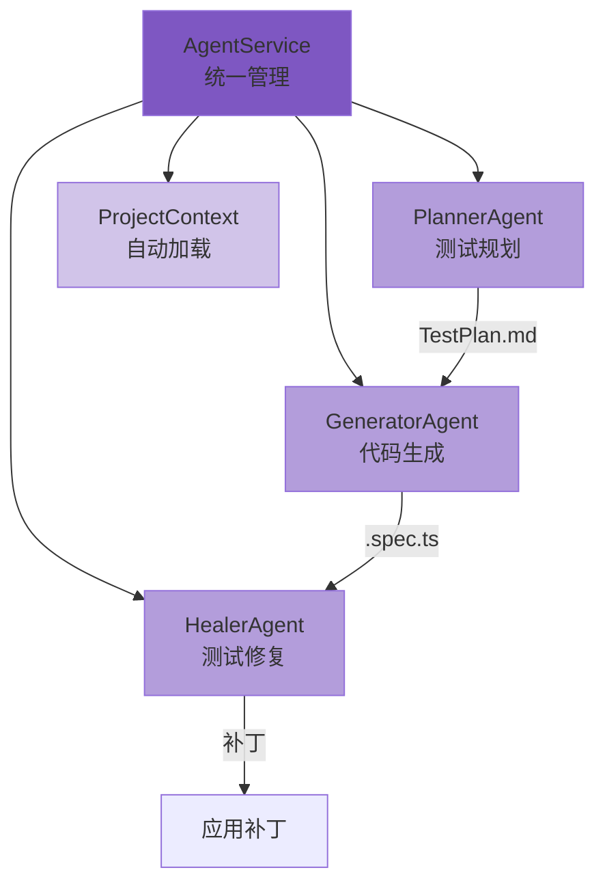
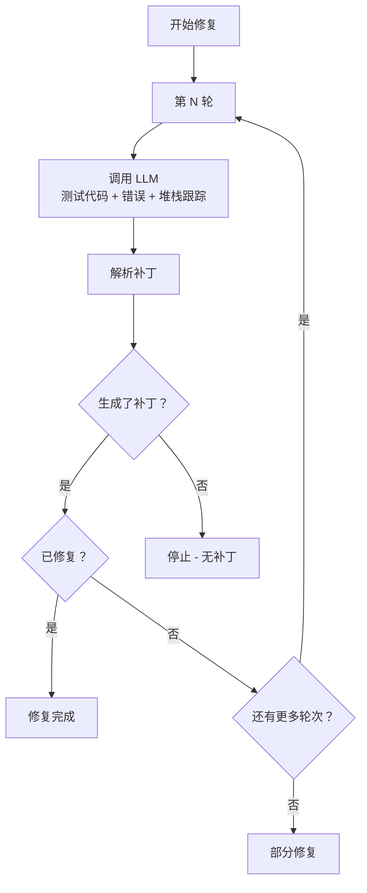

# AI Agent 代理系统深度指南

YuanTest Playwright 的 Agent 代理系统通过三个专用代理提供 AI 驱动的测试创建和修复能力：Planner（规划）、Generator（生成）和 Healer（修复）。

## 1. 系统架构

Agent 代理系统由以下核心组件构成：



| 组件 | 源文件 | 职责 |
|------|--------|------|
| UnifiedAIService | `src/ai/ai-service.ts` | 统一门面，合并 ChatService + AgentService |
| AgentService (已废弃) | `src/agents/index.ts` | 向后兼容的 UnifiedAIService 别名 |
| PlannerAgent | `src/agents/planner.ts` | 根据功能描述生成结构化测试计划 |
| GeneratorAgent | `src/agents/generator.ts` | 将测试计划转换为 Playwright TypeScript 代码 |
| HealerAgent | `src/agents/healer.ts` | 分析失败测试并生成修复补丁 |

## 2. 项目上下文

Agent 代理系统自动加载项目上下文以提供更精确的结果：

### 2.1 上下文来源

| 来源 | 提取的信息 |
|------|-----------|
| `playwright.config.ts/js/mts` | baseURL、timeout、testDir、viewport |
| `package.json` | 项目名称、依赖、技术栈检测 |
| 测试 Fixtures | 自动发现 `tests/fixtures.ts` 或 `test/fixtures.ts` |

### 2.2 技术栈检测

系统从 `package.json` 依赖中自动检测以下技术：

- **前端框架**：React、Vue、Angular、Svelte
- **元框架**：Next.js、Nuxt
- **构建工具**：Vite、Webpack

### 2.3 上下文使用

项目上下文被注入到 Planner 代理的提示中，以生成带有具体定位器的精确测试步骤：

```
被测应用信息：
- 应用 URL: http://localhost:3000
- 技术栈: React, Vite
- 视口: 1280x720
- 默认超时: 30000ms
- 测试目录: ./e2e
- Fixtures: tests/fixtures.ts
- 项目名称: my-app
- 项目根目录: /path/to/project
```

## 3. Planner 代理（测试规划）

### 3.1 工作原理

1. 接收自然语言的功能描述
2. 加载项目上下文（baseURL、技术栈、视口等）
3. 可选地包含参考测试代码和 PRD 文档内容
4. 使用结构化系统提示调用 LLM，要求 JSON 输出
5. 将响应解析为 `TestPlan` 对象
6. 将计划保存为 Markdown 文件

### 3.2 系统提示设计

Planner 代理使用精心设计的系统提示：
- 指示 LLM 作为专业的测试规划专家
- 要求使用具体的页面元素定位器（getByRole、getByText、getByLabel）
- 强制仅 JSON 输出格式（无 markdown、无代码块）
- 定义精确的 JSON 结构：`title`、`description`、`scenarios[].name/steps/expectedResults`

### 3.3 计划输出格式

生成的计划保存为 Markdown 文件：

```markdown
# 用户登录流程

测试完整的用户登录流程，包括表单验证

**Seed:** `tests/example.spec.ts`

## 有效登录

**步骤：**
1. 导航到登录页面 on `login-page`
2. 输入用户名 with "testuser"
3. 输入密码 with "password123"
4. 点击提交按钮 on `submit-btn`

**预期结果：**
- 用户被重定向到仪表盘
- 显示欢迎消息
```

### 3.4 使用参考测试

参考测试为 LLM 提供代码风格和模式的参考：

```typescript
const result = await agentService.plan('购物车功能', {
  seedTest: 'tests/cart.spec.ts',  // 代码风格参考
});
```

### 3.5 使用 PRD 文档

PRD 文档帮助将测试计划与产品需求对齐：

```typescript
const result = await agentService.plan('支付功能', {
  prdPath: 'docs/payment-prd.md',  // PRD 内容（使用前 3000 字符）
});
```

## 4. Generator 代理（代码生成）

### 4.1 工作原理

1. 读取 Markdown 测试计划文件
2. 可选地包含参考测试代码以保持风格一致
3. 使用 TypeScript 代码生成提示调用 LLM
4. 从响应中提取代码块
5. 将每个代码块保存为 `.spec.ts` 文件

### 4.2 代码生成准则

Generator 代理遵循以下准则：
- 使用现代 Playwright 定位器（`page.getByRole`、`page.getByText`、`page.getByLabel`）
- 包含适当的断言
- 遵循测试最佳实践
- 每个测试场景独立可运行
- 代码以 import 语句开头

### 4.3 代码块提取

代理提取包含 Playwright 测试模式的代码块：
- 包含 `test(` 或 `test.describe` 的块
- 包含 `import` 语句的块
- LLM 响应中的 TypeScript/JavaScript 代码块

### 4.4 文件命名

生成的文件根据测试描述命名：
- `test.describe('购物车')` → `shopping-cart.spec.ts`
- `test('用户可以登录')` → `user-can-login.spec.ts`
- 回退：`generated-{timestamp}.spec.ts`

## 5. Healer 代理（测试修复）

### 5.1 工作原理



### 5.2 多轮修复

Healer 代理支持多轮修复：
- 默认：3 轮（可通过 `maxHealRounds` 配置）
- 每轮接收上一轮的摘要作为额外上下文
- 第 N 轮提示包含："这是第 N 轮修复尝试，之前的修复可能未完全解决问题"
- 如果未生成补丁或测试标记为已修复，则提前停止

### 5.3 补丁格式

每个补丁包含：

| 字段 | 说明 |
|------|------|
| `filePath` | 补丁目标文件路径 |
| `originalCode` | 要替换的原始代码 |
| `patchedCode` | 替换后的新代码 |
| `unifiedDiff` | 统一 Diff 输出 |
| `confidence` | 置信度评分（0-1） |
| `reason` | 修复原因说明 |

### 5.4 安全机制

- **路径验证**：补丁只能应用于项目根目录内的文件
- **内容验证**：应用前检查 `originalCode` 是否存在于目标文件中
- **手动审核**：默认（`autoHeal: false`）补丁需要手动批准

### 5.5 自动修复模式

启用 `autoHeal` 时：
```typescript
const agentService = new AgentService('./test-data', {
  autoHeal: true,
  maxHealRounds: 5,
}, llmConfig);
```

补丁在生成后自动应用，每个补丁标记为 `appliedBy: 'auto'`。

## 6. LLM 配置

Agent 代理系统使用与 AI 诊断模块相同的 LLM 配置：

```typescript
interface LLMConfig {
  enabled: boolean;
  baseUrl: string;      // 默认：'http://localhost:11434'
  model: string;        // 例如：'qwen2.5-coder:7b'
  apiKey?: string;
  maxTokens?: number;   // Planner: 4096, Generator: 8192, Healer: 4096
  temperature?: number; // Planner: 0.3, Generator: 0.2, Healer: 0.2
}
```

### 6.1 推荐模型

| 代理 | 推荐模型 | 原因 |
|------|---------|------|
| Planner | qwen2.5-coder:7b+ | 擅长结构化 JSON 输出 |
| Generator | qwen2.5-coder:7b+ | 强大的代码生成能力 |
| Healer | qwen2.5-coder:7b+ | 擅长代码分析和补丁生成 |

### 6.2 兼容的 LLM 服务

- **Ollama**（推荐本地使用）：`baseUrl: 'http://localhost:11434'`
- **OpenAI**：`baseUrl: 'https://api.openai.com/v1'`
- **vLLM**：任何 OpenAI 兼容端点
- **Azure OpenAI**：Azure OpenAI 端点

## 7. 修复历史

### 7.1 存储

修复历史持久化到 `{dataDir}/agent-heal-history.json`：
- 最多 100 条记录（自动清理）
- 每条记录包含：testId、testTitle、patches、healed 状态、roundsUsed

### 7.2 访问历史

```
GET /api/v1/agents/heal-history
```

## 8. CLI 使用

### 8.1 初始化代理

```bash
# 为 VSCode 初始化
yuantest agents init

# 为 Claude 初始化
yuantest agents init --loop claude

# 为 OpenCode 初始化
yuantest agents init --loop opencode
```

### 8.2 生成测试计划

```bash
# 基本用法
yuantest agents plan "用户登录流程"

# 使用参考测试和 PRD
yuantest agents plan "购物车功能" --seed tests/cart.spec.ts --prd docs/prd.md
```

### 8.3 生成测试代码

```bash
# 从计划文件生成
yuantest agents generate specs/user-login-flow.md

# 自定义输出目录
yuantest agents generate specs/user-login-flow.md --output tests/
```

### 8.4 修复失败测试

```bash
# 基本修复
yuantest agents heal tests/login.spec.ts

# 提供错误上下文并自动应用
yuantest agents heal tests/login.spec.ts --error "超时" --apply
```

### 8.5 列出计划

```bash
yuantest agents list
```

## 9. REST API

所有 Agent 功能都可通过 REST API 访问：

| 方法 | 端点 | 说明 |
|------|------|------|
| `GET` | `/api/v1/agents/config` | 获取代理配置 |
| `PUT` | `/api/v1/agents/config` | 更新代理配置 |
| `GET` | `/api/v1/agents/project-context` | 获取项目上下文 |
| `POST` | `/api/v1/agents/init` | 初始化代理定义 |
| `POST` | `/api/v1/agents/plan` | 生成测试计划 |
| `POST` | `/api/v1/agents/generate` | 生成测试代码 |
| `POST` | `/api/v1/agents/heal` | 修复失败测试 |
| `POST` | `/api/v1/agents/apply-patch` | 应用指定补丁 |
| `GET` | `/api/v1/agents/plans` | 列出测试计划 |
| `GET` | `/api/v1/agents/heal-history` | 查看修复历史 |

## 10. 最佳实践

### 10.1 编写功能描述

- 具体描述功能和用户交互
- 包含页面名称、元素名称和预期行为
- 提及特殊条件或边界情况

**好的描述**："用户使用邮箱和密码登录的流程，包括表单验证和错误提示"

**不好的描述**："登录测试"

### 10.2 使用参考测试

- 提供一个代表性的测试文件，展示你偏好的代码风格
- 包含常用的 import、fixtures 和辅助函数
- Generator 代理将遵循相同的模式

### 10.3 修复工作流

1. 运行失败测试获取确切的错误信息
2. 将错误信息和堆栈跟踪提供给 Healer 代理
3. 在应用前审查生成的补丁
4. 如果第一轮未完全修复，代理将尝试额外的轮次
5. 仅在开发环境中使用 `autoHeal: true`

### 10.4 LLM 配置建议

- 使用代码专用模型以获得最佳效果（如 qwen2.5-coder）
- 较低的 temperature（0.2-0.3）以获得更一致的输出
- 在使用 Agent 功能前确保 LLM 服务正在运行且可访问
