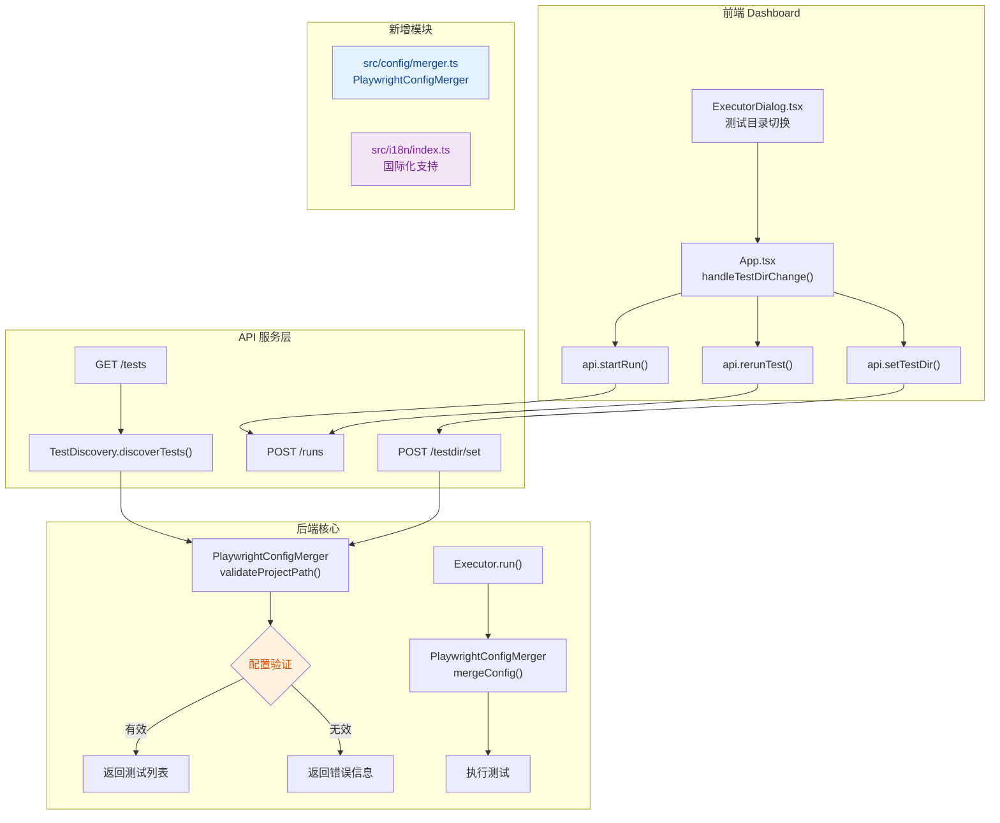

## 1. 高层摘要（TL;DR）

*   **影响范围：** 🟡 **中等** - 涉及配置管理、API 响应结构、默认端口和国际化支持
*   **核心变更：**
    *   ✨ 新增 Playwright 配置文件验证与合并机制
    *   🔄 API 响应从布尔值改为结构化对象，增强错误信息
    *   🔧 默认端口从 3000 改为 5274
    *   🌍 完善国际化（i18n）支持体系
    *   🎨 移除 CDN 依赖，改用本地 FontAwesome

---

## 2. 可视化概览（代码与逻辑图）



---

## 3. 详细变更分析

### 📦 3.1 配置管理模块（新增）

**组件名称：** `PlaywrightConfigMerger`  
**变更文件：** `src/config/merger.ts`（新增文件）

**核心功能：**
-   **配置文件发现：** 自动查找 `playwright.config.ts/js/mts/mjs`
-   **配置验证：** 检查配置文件是否存在、是否可解析
-   **配置合并：** 将用户配置与框架默认配置智能合并
-   **Reporter 管理：** 自动注入框架必需的 html/json reporter

**关键方法：**

| 方法名 | 功能描述 |
|--------|----------|
| `findPlaywrightConfig()` | 在项目目录中查找 Playwright 配置文件 |
| `validateProjectPath()` | 验证项目路径和配置文件有效性 |
| `mergeConfig()` | 合并用户配置与框架默认配置 |
| `loadPlaywrightConfig()` | 动态加载配置文件（支持 TS/JS） |

**代码片段（配置合并逻辑）：**
```typescript
const mergedReporter = this.mergeReporters(externalConfig.reporter, frameworkOutputDir);
// 自动过滤 html/json reporter，避免冲突
// 强制注入框架必需的 reporter 配置
```

---

### 🌍 3.2 国际化支持（新增）

**组件名称：** `i18n` 模块  
**变更文件：** `src/i18n/index.ts`（新增文件）

**核心功能：**
-   支持中文（`zh`）和英文（`en`）
-   提供全局语言切换函数 `setLang()`
-   翻译函数 `t(key, lang?)` 支持动态语言

**新增翻译条目：**

| Key | 中文 | 英文 |
|-----|------|------|
| `configNotFound` | 未找到 playwright.config.ts 配置文件 | playwright.config.ts not found |
| `configParseFailed` | 配置文件解析失败 | Failed to parse config file |
| `testDirNotFound` | 测试目录不存在 | Test directory not found |
| `executorAlreadyRunning` | 执行器正在运行中 | Executor is running |

---

### 🔌 3.3 API 响应结构优化

**组件名称：** API 服务层  
**变更文件：** `dashboard/src/services/api.ts`

**变更说明：**
将 `startRun()` 和 `rerunTest()` 的返回值从 `boolean` 改为结构化对象 `StartRunResult`，提供详细的错误信息。

**接口定义：**
```typescript
export interface StartRunResult {
  success: boolean;
  error?: string;  // 新增错误详情字段
}
```

**影响范围：**

| API 端点 | 旧返回值 | 新返回值 | 变更原因 |
|---------|---------|---------|---------|
| `POST /runs` | `boolean` | `StartRunResult` | 提供错误详情 |
| `POST /runs` (rerun) | `boolean` | `StartRunResult` | 提供错误详情 |

---

### 🎨 3.4 前端 UI 改进

**组件名称：** Dashboard 前端  
**变更文件：** `dashboard/src/App.tsx`, `dashboard/src/components/ExecutorDialog.tsx`

**主要变更：**

1.  **移除"刷新测试用例"按钮**
    -   原因：测试目录切换时自动刷新，无需手动操作
    -   影响文件：`ExecutorDialog.tsx` 删除 `onRefreshTests` 回调

2.  **增强错误处理**
    -   新增 `formatStartError()` 函数，将技术错误转换为用户友好的提示
    -   配置验证失败时清空测试列表

3.  **测试目录切换逻辑优化**
    ```typescript
    // 新增：配置验证结果处理
    if (result.configExists) {
      addLog(`✅ ${t('testDirSetSuccess', lang)}: ${result.configPath}`, 'success');
    } else {
      addLog(`❌ ${t('configNotFound', lang)}`, 'error');
    }
    ```

---

### 📦 3.5 依赖与资源管理

**组件名称：** 依赖管理  
**变更文件：** `package.json`, `dashboard/index.html`, `dashboard/src/main.tsx`

**变更内容：**

| 项目 | 旧值 | 新值 | 原因 |
|------|------|------|------|
| FontAwesome CDN | `https://cdnjs.cloudflare.com/ajax/libs/font-awesome/6.0.0-beta3/css/all.min.css` | 本地包 `@fortawesome/fontawesome-free` | 提高稳定性，减少外部依赖 |
| package.json 依赖 | - | `@fortawesome/fontawesome-free: ^7.2.0` | 新增本地依赖 |
| dev 脚本 | `npx tsx src/cli.ts` | `npx tsx src/cli/index.ts` | 修正路径 |

---

### ⚙️ 3.6 配置与端口变更

**组件名称：** 系统配置  
**变更文件：** `README.md`, `README.en.md`

**端口变更表：**

| 配置项 | 旧端口 | 新端口 | 影响范围 |
|--------|--------|--------|----------|
| 默认 UI 端口 | 3000 | 5274 | 所有文档和示例 |
| DashboardServer 构造函数 | 3000 | 5274 | API 文档 |
| 配置文件示例 | 3000 | 5274 | 用户配置 |

**变更原因：** 避免与其他常用服务（如 React Dev Server）的端口冲突。

---

### 🔧 3.7 后端服务增强

**组件名称：** UI 服务器  
**变更文件：** `src/ui/server.ts`

**核心改进：**

1.  **语言中间件**
    ```typescript
    v1Router.use((req, res, next) => {
      const lang = req.query.lang || 
                   (req.headers['accept-language']?.startsWith('zh') ? 'zh' : 'en') || 'zh';
      setLang(lang);
      this.testDiscovery.setLang(lang);
      next();
    });
    ```

2.  **测试目录验证重构**
    -   移除手动文件系统检查
    -   使用 `PlaywrightConfigMerger.validateProjectPath()` 统一验证
    -   返回配置路径和警告信息

3.  **测试发现 API 增强**
    -   返回值新增 `configValidation` 字段
    -   配置无效时返回错误详情而非空列表

---

### 🧪 3.8 测试发现与执行器改进

**组件名称：** 测试引擎  
**变更文件：** `src/discovery/index.ts`, `src/executor/index.ts`

**测试发现改进：**

| 方法 | 变更内容 |
|------|---------|
| `discoverTests()` | 返回值新增 `configValidation` 字段 |
| `validateProjectPath()` | 新增方法，委托给 `PlaywrightConfigMerger` |
| `runPlaywrightListJSON()` | 使用配置文件所在目录作为工作目录 |

**执行器改进：**

```typescript
// 旧代码：硬编码配置路径
const projectConfigPath = path.resolve('playwright.config.ts');

// 新代码：动态合并配置
const mergedConfig = await this.configMerger.mergeConfig(testDir, this.config.outputDir);
const configPath = mergedConfig.configPath;
const cwd = configPath ? path.dirname(configPath) : process.cwd();
```

---

### 🐛 3.9 其他修复

**组件名称：** CLI 与测试  
**变更文件：** `src/cli/index.ts`, `tests/e2e/cli.e2e.test.ts`

| 文件 | 变更 | 原因 |
|------|------|------|
| `src/cli/index.ts` | 添加 `Artifact` 类型导入 | TypeScript 类型安全 |
| `tests/e2e/cli.e2e.test.ts` | 断言消息更新 | 匹配新的 CLI 输出 |
| `src/config/loader.ts` | 错误对象添加 `cause` 属性 | 改进错误追踪 |

---

## 4. 影响与风险评估

### ⚠️ 破坏性变更

| 变更项 | 影响范围 | 迁移建议 |
|--------|---------|---------|
| **默认端口 3000 → 5274** | 所有使用默认端口的用户 | 更新文档、脚本和配置文件中的端口号 |
| **API 响应结构** | 前端调用 `startRun()`/`rerunTest()` 的代码 | 检查返回值类型，从 `boolean` 改为 `{ success, error? }` |
| **测试目录验证** | 依赖旧验证逻辑的代码 | 使用新的 `validateProjectPath()` 方法 |

### 🔍 测试建议

**必须测试的场景：**

1.  ✅ **配置验证**
    -   测试目录包含有效 `playwright.config.ts`
    -   测试目录缺少配置文件（应显示友好错误）
    -   配置文件语法错误（应返回解析错误）

2.  ✅ **端口变更**
    -   启动 Dashboard 确认使用 5274 端口
    -   自定义端口参数仍然有效

3.  ✅ **错误处理**
    -   执行器运行时启动新的执行（应显示"执行器正在运行"错误）
    -   网络错误时的提示信息
    -   配置无效时的 UI 提示

4.  ✅ **国际化**
    -   切换中英文，验证所有错误消息正确显示
    -   API 返回的错误消息与语言设置匹配

5.  ✅ **向后兼容**
    -   旧的配置文件仍然可以正常加载
    -   没有 `playwright.config.ts` 时使用默认配置

---

## 5. 总结

本次变更是一个**中等规模的架构优化**，主要聚焦于：

1.  **配置管理现代化** - 引入专门的配置验证和合并机制
2.  **用户体验提升** - 更详细的错误信息和国际化支持
3.  **稳定性改进** - 移除外部 CDN 依赖，统一验证逻辑
4.  **端口冲突避免** - 更改默认端口为 5274

**建议优先级：** 🟡 建议尽快合并，但需要充分测试配置验证和错误处理逻辑。