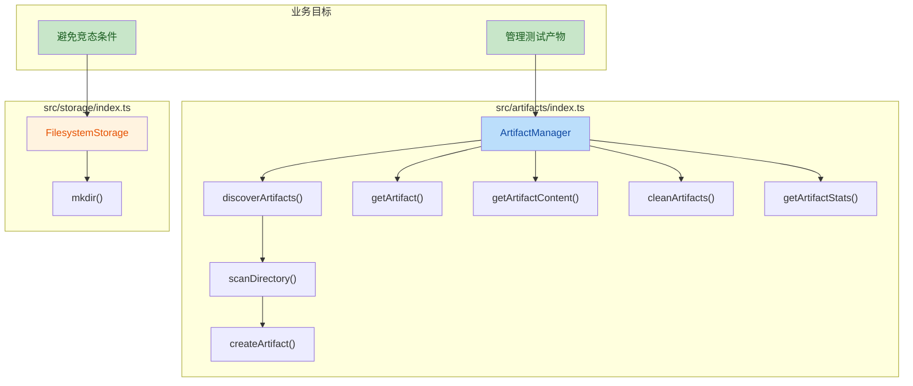

## 1. 高层摘要 (TL;DR)

*   **影响:** **中等** - 新增了完整的测试产物管理模块，并修复了目录创建的竞态条件问题
*   **关键变更:**
    *   ✨ 新增 `ArtifactManager` 类，提供测试产物的发现、查询、清理等功能
    *   🐛 修复 `FilesystemStorage.mkdir()` 的竞态条件问题，避免并发创建目录时的错误
    *   🧪 优化测试用例，添加 mock 避免实际执行 Playwright 测试
    *   📝 修正 `.gitignore` 规则，确保正确忽略项目根目录下的产物文件夹

---

## 2. 可视化概览 (代码与逻辑映射)



### ArtifactManager 核心方法说明

| 方法 | 功能描述 |
|------|----------|
| `discoverArtifacts()` | 扫描目录发现所有测试产物 |
| `getArtifact()` | 根据 ID 或路径获取单个产物 |
| `getArtifactContent()` | 读取产物文件内容 |
| `deleteArtifact()` | 删除指定产物文件 |
| `cleanArtifacts()` | 清理过期产物（默认7天） |
| `getArtifactsByType()` | 按类型筛选产物（截图/视频/trace） |
| `getArtifactsByTest()` | 按测试ID筛选产物 |
| `getArtifactStats()` | 获取产物统计信息 |

---

## 3. 详细变更分析

### 📁 组件 1: 新增 ArtifactManager 模块

**文件:** `src/artifacts/index.ts` (新文件)

**变更说明:**
- 新增完整的 `ArtifactManager` 类，继承自 `BaseManager`
- 提供测试产物（截图、视频、trace 文件）的全生命周期管理

**核心功能:**

#### 3.1 产物发现与扫描
```typescript
async discoverArtifacts(runId?: string): Promise<Artifact[]>
```
- 支持按 `runId` 过滤或扫描整个基础目录
- 递归扫描子目录，自动识别文件类型
- 支持文件大小限制过滤（通过 `maxFileSize` 配置）

#### 3.2 产物类型识别
| 扩展名 | 类型 | MIME Type |
|--------|------|-----------|
| `.png`, `.jpg`, `.jpeg`, `.webp`, `.gif`, `.bmp` | `screenshot` | `image/*` |
| `.webm`, `.mp4`, `.ogg` | `video` | `video/*` |
| `.zip`, `.trace` | `trace` | `application/zip` 或 `application/octet-stream` |
| 其他 | `attachment` | `application/octet-stream` |

#### 3.3 产物清理机制
```typescript
async cleanArtifacts(olderThan?: number): Promise<number>
```
- 默认清理超过 7 天的产物
- 递归删除过期文件
- 自动清理空目录

---

### 🔧 组件 2: 修复目录创建竞态条件

**文件:** `src/storage/index.ts`

**变更说明:**
修复了 `FilesystemStorage.mkdir()` 方法在并发场景下的竞态条件问题。

**变更前后对比:**

| 方面 | 变更前 | 变更后 |
|------|--------|--------|
| 逻辑 | 直接调用 `mkdir()` | 先检查目录是否存在 |
| 并发处理 | ❌ 可能抛出 `EEXIST` 错误 | ✅ 捕获并忽略 `EEXIST` 错误 |
| 代码行数 | 1 行 | 18 行 |

**修复逻辑:**
```typescript
async mkdir(dirPath: string): Promise<void> {
  try {
    await fs.promises.access(dirPath);  // 先检查是否存在
    return;
  } catch {
    // 目录不存在，继续创建
  }
  try {
    await fs.promises.mkdir(dirPath, { recursive: true });
  } catch (error) {
    const nodeError = error as NodeJS.ErrnoException;
    if (nodeError.code === 'EEXIST') {  // 竞态条件处理
      return;
    }
    throw error;  // 其他错误继续抛出
  }
}
```

---

### 🧪 组件 3: 测试优化

**文件:** 
- `tests/integration/orchestrator-executor.integration.test.ts`
- `tests/unit/executor.test.ts`

**变更说明:**
在测试用例中添加 mock，避免实际执行 Playwright 测试。

**变更内容:**
```typescript
jest.spyOn(executor as any, 'runPlaywrightTests').mockImplementation(async () => {});
```

**目的:**
- 防止测试执行时实际运行 Playwright，提高测试速度
- 确保测试专注于验证"重复执行"逻辑，而非 Playwright 本身

---

### 📝 组件 4: .gitignore 规则修正

**文件:** `.gitignore`

**变更说明:**
修正了产物目录的忽略规则，确保正确忽略项目根目录下的文件夹。

| 规则 | 变更前 | 变更后 |
|------|--------|--------|
| artifacts/ | `artifacts/` | `/artifacts/` |
| traces/ | `traces/` | `/traces/` |
| visual-testing/ | `visual-testing/` | `/visual-testing/` |
| html-report/ | `html-report/` | `/html-report/` |

**说明:**
- 添加前导 `/` 表示仅忽略项目根目录下的这些文件夹
- 避免误忽略子目录中同名文件夹

---

## 4. 影响与风险评估

### ⚠️ 破坏性变更
**无** - 所有变更均为新增或向后兼容的修复

### ✅ 测试建议

| 测试场景 | 验证要点 |
|----------|----------|
| **并发目录创建** | 多个进程/线程同时调用 `mkdir()` 创建同一目录，不应抛出错误 |
| **产物发现** | 验证 `ArtifactManager` 能正确扫描并识别各种类型的产物文件 |
| **产物清理** | 测试 `cleanArtifacts()` 能正确删除过期文件并清理空目录 |
| **类型识别** | 验证不同扩展名的文件能被正确分类为 screenshot/video/trace |
| **文件大小过滤** | 测试 `maxFileSize` 配置能正确过滤大文件 |
| **Git 忽略规则** | 确认根目录下的产物文件夹被正确忽略，子目录中同名文件夹不受影响 |

### 🔍 潜在风险点

1. **产物 ID 冲突:** 使用 MD5(filePath) 生成 ID，理论上可能存在哈希冲突（概率极低）
2. **大目录扫描:** `discoverArtifacts()` 递归扫描可能在产物数量巨大时影响性能
3. **并发清理:** `cleanArtifacts()` 在并发执行时可能产生竞争条件（删除文件的同时其他进程正在读取）

---

## 5. 总结

本次变更主要引入了完整的测试产物管理能力，并修复了目录创建的竞态条件问题。`ArtifactManager` 提供了丰富的 API 来管理测试运行产生的截图、视频和 trace 文件，为后续的测试报告和调试功能奠定了基础。同时，修复的竞态条件问题和测试优化提高了系统的稳定性和可测试性。